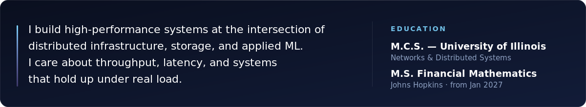

<picture>
  <source media="(prefers-color-scheme: dark)" srcset="assets/hero-dark.svg" />
  <source media="(prefers-color-scheme: light)" srcset="assets/hero-light.svg" />
  
</picture>

<picture>
  <source media="(prefers-color-scheme: dark)" srcset="assets/about-dark.svg" />
  <source media="(prefers-color-scheme: light)" srcset="assets/about-light.svg" />
  
</picture>

<picture>
  <source media="(prefers-color-scheme: dark)" srcset="assets/metrics-dark.svg" />
  <source media="(prefers-color-scheme: light)" srcset="assets/metrics-light.svg" />
  
</picture>

<picture>
  <source media="(prefers-color-scheme: dark)" srcset="assets/div-tech-dark.svg" />
  <source media="(prefers-color-scheme: light)" srcset="assets/div-tech-light.svg" />
  
</picture>

<picture>
  <source media="(prefers-color-scheme: dark)" srcset="assets/tech-dark.svg" />
  <source media="(prefers-color-scheme: light)" srcset="assets/tech-light.svg" />
  
</picture>

<picture>
  <source media="(prefers-color-scheme: dark)" srcset="assets/div-projects-dark.svg" />
  <source media="(prefers-color-scheme: light)" srcset="assets/div-projects-light.svg" />
  
</picture>

<a href="https://github.com/aaruldhawan02/RDMA-Distributed-KV-Store"><picture><source media="(prefers-color-scheme: dark)" srcset="assets/proj-rdma-dark.svg" /><source media="(prefers-color-scheme: light)" srcset="assets/proj-rdma-light.svg" /></picture></a> <a href="https://github.com/aaruldhawan02/sackv"><picture><source media="(prefers-color-scheme: dark)" srcset="assets/proj-sackv-dark.svg" /><source media="(prefers-color-scheme: light)" srcset="assets/proj-sackv-light.svg" /></picture></a>

<a href="https://github.com/PillaiFanClub/Ladidadidaaaa"><picture><source media="(prefers-color-scheme: dark)" srcset="assets/proj-karaoke-dark.svg" /><source media="(prefers-color-scheme: light)" srcset="assets/proj-karaoke-light.svg" /></picture></a> <a href="https://github.com/PillaiFanClub/Ladidadidaaaa"><picture><source media="(prefers-color-scheme: dark)" srcset="assets/proj-payoff-dark.svg" /><source media="(prefers-color-scheme: light)" srcset="assets/proj-payoff-light.svg" /></picture></a>

<picture>
  <source media="(prefers-color-scheme: dark)" srcset="assets/div-experience-dark.svg" />
  <source media="(prefers-color-scheme: light)" srcset="assets/div-experience-light.svg" />
  
</picture>

<picture>
  <source media="(prefers-color-scheme: dark)" srcset="assets/timeline-dark.svg" />
  <source media="(prefers-color-scheme: light)" srcset="assets/timeline-light.svg" />
  
</picture>

<picture>
  <source media="(prefers-color-scheme: dark)" srcset="assets/roles-dark.svg" />
  <source media="(prefers-color-scheme: light)" srcset="assets/roles-light.svg" />
  
</picture>

<picture>
  <source media="(prefers-color-scheme: dark)" srcset="assets/footer-dark.svg" />
  <source media="(prefers-color-scheme: light)" srcset="assets/footer-light.svg" />
  
</picture>
