<picture>
  <source media="(prefers-color-scheme: dark)" srcset="assets/hero-dark.svg" />
  <source media="(prefers-color-scheme: light)" srcset="assets/hero-light.svg" />
  
</picture>

## About

I build high-performance systems at the intersection of distributed infrastructure, storage, and applied ML. I care about throughput, latency, and systems that hold up under real load.

**Currently** — Incoming SDE @ AWS S3 Express 
**Jan 2027** — MS Financial Mathematics @ Johns Hopkins

## Tech

<table>
  <tr>
    <td width="200"><b>Languages</b></td>
    <td width="680">
      
      
      
      
      
      
    </td>
  </tr>
  <tr>
    <td width="200"><b>Systems &amp; Cloud</b></td>
    <td width="680">
      
      
      
      
    </td>
  </tr>
  <tr>
    <td width="200"><b>Frameworks &amp; Data</b></td>
    <td width="680">
      
      
      
      
    </td>
  </tr>
</table>

## Featured Projects

<table>
  <tr>
    <td width="50%" valign="top">
      <a href="https://github.com/aaruldhawan02/RDMA-Distributed-KV-Store"><b>RDMA Distributed KV Store</b></a> 
      CS598 Storage Systems · Spring 2026
      
Distributed KV store using one-sided RDMA over RoCE targeting sub-millisecond latencies. Reed–Solomon erasure coding and SWIM failure detection.

      
      
    </td>
    <td width="50%" valign="top">
      <a href="https://github.com/aaruldhawan02/sackv"><b>Chunk-Level KV Cache Eviction</b></a> 
      CS598 GenAI Systems · Spring 2026
      
Fork of vLLM v0.18.0 with semantic chunk-level KV cache eviction for RAG workloads. Eviction scores combine retrieval relevance, attention, and recency.

      
      
      
    </td>
  </tr>
  <tr>
    <td width="50%" valign="top">
      <a href="https://github.com/PillaiFanClub/Ladidadidaaaa"><b>Arcade Karaoke</b></a> 
      Hack@Brown 2025 · AWS Award Winner
      
Multiplayer karaoke game with real-time pitch-based scoring using Librosa PYIN and WebSockets.

      
      
      
    </td>
    <td width="50%" valign="top">
      <a href="https://github.com/PillaiFanClub/Ladidadidaaaa"><b>PayOff</b></a> 
      Hack@Brown 2026
      
Peer-to-peer offline payment via Apple Bonjour — no WiFi required. ECDH handshake via Apple CryptoKit.

      
      
    </td>
  </tr>
</table>

## Experience

**Amazon Web Services** — SDE Intern, S3 Express 
Seattle, WA · May–Aug 2025
- Re-architected a legacy Java load generator into a Rust system, improving throughput **400%+** with consistent **sub-10ms p99 latency**
- Deployed on EKS with autoscaling across hundreds of pods; p50–p99.9 latency and TPS metrics published to CloudWatch

**Epic Systems** — Software Developer Intern 
Madison, WI · May–Aug 2024
- Built a cross-platform AI assistant (C#, Python, React) for echocardiogram comparison — estimated to save **$3.4M+ annually**
- Designed an LLM evaluation metric for patient summarization; presented to 200+ attendees

**Disruption Lab** (Client: AMD) — Software Engineer 
Champaign, IL · Aug 2023–May 2024
- Improved model robustness **2.1x** in noisy environments via dynamic mixing and noise augmentation on AWS SageMaker

**Epivara** — Software Engineer Intern 
UIUC Research Park · Sept 2024–Jan 2025
- Built an NLP-powered graph generation tool over SQL data for experimental data exploration

**TechSur Solutions** — Software Developer Intern 
Herndon, VA · Jun–Aug 2023
- Built a document recommendation system using TF-IDF + Pinecone on GCP

<picture>
  <source media="(prefers-color-scheme: dark)" srcset="assets/footer-dark.svg" />
  <source media="(prefers-color-scheme: light)" srcset="assets/footer-light.svg" />
  
</picture>
